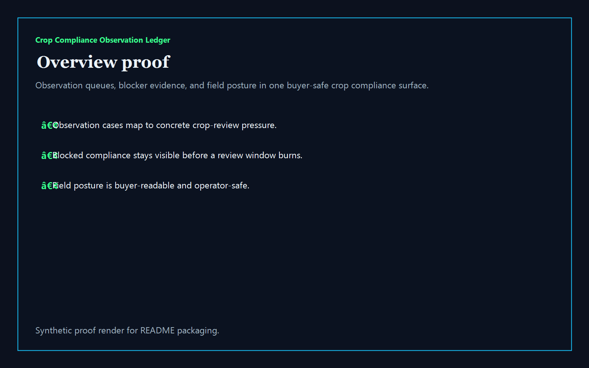
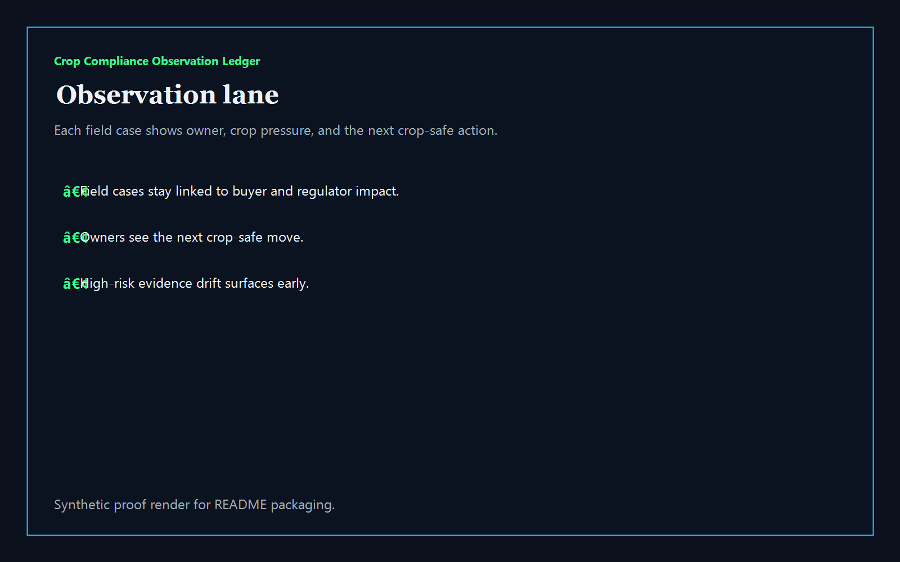
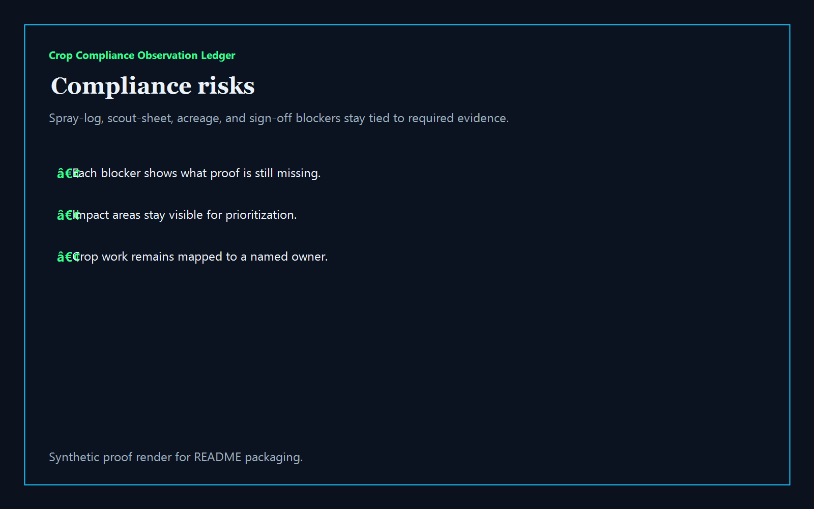
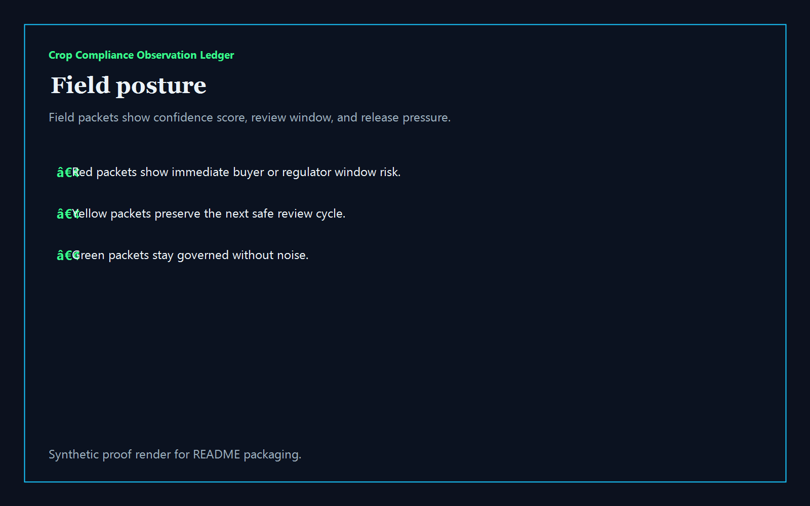

# Crop Compliance Observation Ledger

[](https://github.com/mizcausevic-dev/crop-compliance-observation-ledger/actions/workflows/ci.yml)
[](./LICENSE)
[](./.github/dependabot.yml)
[](https://github.com/mizcausevic-dev/crop-compliance-observation-ledger/actions/workflows/pages.yml)

TypeScript control plane for crop observations, evidence blockers, field posture, and buyer-safe agri compliance operations.

## Why this exists

- Agri teams lose trust when spray logs, scout notes, acreage summaries, and grower approvals drift in different places at different speeds.
- Crop compliance needs a clear view of which field observations are active, which blockers still need proof, and which packets should not move yet.
- AgriTech buyers care whether audit, export, conservation, and buyer-review operations can stay safe without fragmenting field, compliance, and program workflows.
- Operators want tooling that turns observation chaos into governed lanes, named ownership, and measurable review posture.

## Why this matters (KG Embedded tie-back)

This repo demonstrates the crop-compliance primitive for AgriTech buyers: field observations, evidence blockers, and audit-facing posture tied into one operator surface. A B2B SaaS buyer would care because crop, field, and review data often need to surface inside customer-facing products without exposing unsafe write paths or fragmented operational evidence. Kinetic Gain Embedded extends this into security-first in-product analytics for crop compliance, buyer-safe review cadence, and grower-facing workflows, see [kineticgain.com/embedded](https://kineticgain.com/embedded).

## Routes

- `/`
- `/observation-lane`
- `/compliance-risks`
- `/field-posture`
- `/verification`
- `/docs`

## API

- `/api/dashboard/summary`
- `/api/observation-lane`
- `/api/compliance-risks`
- `/api/field-posture`
- `/api/verification`
- `/api/sample`

## Screenshots






## Local Development

```powershell
cd crop-compliance-observation-ledger
npm install
npm run dev
```

Open:
- [http://127.0.0.1:5560/](http://127.0.0.1:5560/)
- [http://127.0.0.1:5560/observation-lane](http://127.0.0.1:5560/observation-lane)
- [http://127.0.0.1:5560/compliance-risks](http://127.0.0.1:5560/compliance-risks)
- [http://127.0.0.1:5560/field-posture](http://127.0.0.1:5560/field-posture)
- [http://127.0.0.1:5560/verification](http://127.0.0.1:5560/verification)

## Validation

- `npm run build`
- `npm run test`
- `npm run coverage`
- `npm run demo`
- `npm run smoke`
- `npm run prerender`
- `npm run render:assets`

## Production status

<!-- Maintained by Claude Code (Platform/SRE lane) after v1.0-prod hardening. -->

| Aspect | Status |
|--------|--------|
| CI | Node 20 + 22 matrix — lint · typecheck · coverage · build · demo · smoke · `npm audit` ([workflow](./.github/workflows/ci.yml)) |
| Test coverage | 100% statements on `src/services/` (gate: ≥ 60%) |
| License | [AGPL-3.0-or-later](./LICENSE) |
| Dependencies | Dependabot weekly (npm + GitHub Actions); `npm audit --audit-level=high` in CI |
| Security | [SECURITY.md](./SECURITY.md) — 0 known high/critical advisories at v1.0-prod |
| Deploy | Static prerender → **https://crops.kineticgain.com/** (GitHub Pages, [pages workflow](./.github/workflows/pages.yml)) |

## Docs

- [Architecture](./docs/architecture.md)
- [Origin](./docs/ORIGIN.md)
- [Kinetic Gain Embedded tie-back](./docs/KINETIC_GAIN_EMBEDDED.md)
- [Changelog](./CHANGELOG.md)

## Part of the Kinetic Gain Suite

Operator surface in the [Kinetic Gain Suite](https://suite.kineticgain.com/) — a portfolio of buyer-readable control planes spanning security posture, compliance evidence, data-platform governance, FinOps, and operator workflows. See the suite index for related surfaces. Apex: [kineticgain.com](https://kineticgain.com/).
